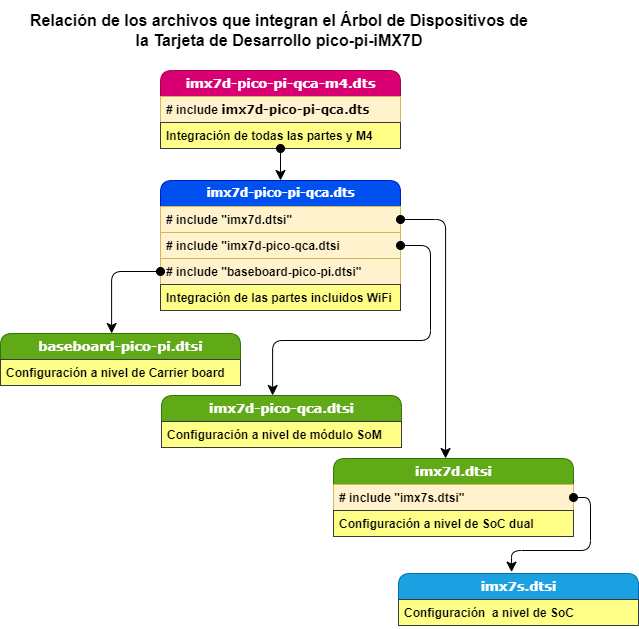

# Arbol-de-dispositivos
Árbol de dispositivospara la tarjeta de desarrollo  pico-pi-IMX7D

9.- Se crea el árbol de dispositivos para su Tarjeta de Desarrollo (pico-pi-iMX7D). El árbol de dispositivos depende tanto del SOM y sus módulos, como del SoC (con los Cortex A7 y del procesador auxilia Cortex M4), así como de la placa base que esté utilizando (la carrier board):

Como estamos construyendo para el SOM Pico-imx7d, montado en una carrier board pico-pi, el comando para construir el árbol de dispositivos es:

`$ make imx7d-pico-pi-qca-m4.dtb`

##### Nota 4:

El DTB debe cargarse en la memoria antes del arranque del kernel. Esto se hace con U-boot. Especifique que el archivo DTB se cargue en una variable de entorno en U-boot que se llame fdt_file. Luego, U-boot escanea la partición de arranque (una partición FAT332) en busca de un archivo con ese nombre. Si encuentra este archivo, lo cargará en la memoria prescrita en la ubicación antes de cargar y arrancar el núcleo. El árbol de dispositivos se construye a partir de un archivo descriptor del hardware localizado, en: `arch/arm/boot/dts/`. Para la versión del kernel utilizado existen varios archivos dts; se usó el archivo `imx7d-pico-pi-qca-m4.dts`. En el cual no vienen configurado el dispositivo Wi-Fi ni Bluetooth correspondiente al módulo APG6335 que es que viene instalado en la Rev. B de la pico-pi-iMX7D; las actuales vienen con el módulo hardware Qualcomm Atheros QCA9377 Bluetooth (optional). Es una carencia que se puede resolver luego; consiguiendo los fuentes para el APG6335 y compilando el módulo para adosar al kernel.

**ver tambien:** [Compilando para la PICO-PI-IMX7D / M4](https://compilando-pico-pi-imx7.blogspot.com/2023/04/compilando-el-kernel-linux.html?view=sidebar) 
